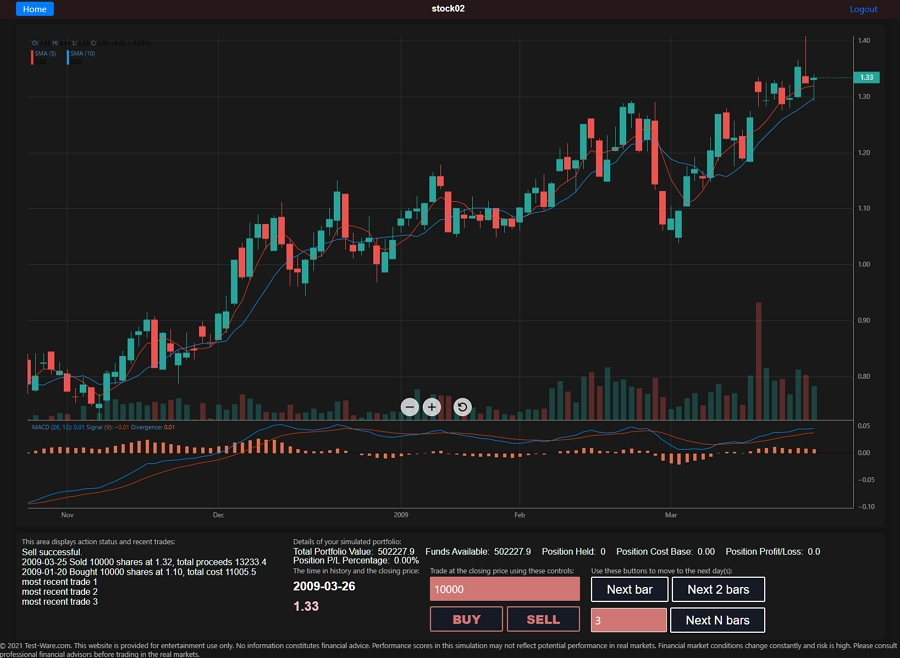

Test-Ware is a web app created to provide trading enthusiasts with a platform to test and improve their trading skills.

[](http://www.gnu.org/licenses/gpl-3.0)

# Frontend Overview
The frontend of the website consists of a static landing page (landing.html) and a web app created using ReactJS.

## Landing Page
The landing page is styled with Bootstrap with text animations from AnimeJS (jQuery-based). Text animations are triggered when the user scrolls down to where they come into view to provide a dynamic yet elegant feel to the page. The triggers of text animations are implemented using Waypoint.

## Trainer App
The ReactJS app, referred to as the “trainer” app, consists of several pages, namely Login, Register, Home, Trainer, and Guest. 

The Login and Register pages each consists of a form that submits user inputs to the server for authentication and registration, respectively. Once the user submits a registration form, the PHP backend of the server will add the record into an SQL database. During the authentication process, the server backend will check the login details against those stored in the database and generate a JSON Web Token (JWT) for the frontend app to use during communications that follows.

The Home page and Trainer pages are only accessible by users who have logged in. This is controlled by a PrivateRoute component that checks login status. 

Once logged in, the Home page fetches a list of challenges from the server and displays this list for user to choose from. The page will also query the server’s database and display a progress bar for each challenge item to show any progress the user has made. Clicking on a challenge item will redirect the user to the Trainer page.

The Trainer page is where the user steps through the historical data and places simulated buy or sell trades as if they are experiencing it in the market. The page displays a StockChart component in the top section of the page and a Controls component in the bottom section. The Constrols component consists of an area that displays recent trade records, an area that shows all portfolio information, the timestamp and price at that point in time, a Trader component that allows the user to place trades, and a Stepper component that moves the time forward in various steps.

The Guest page is a spin-off of Trainer page without the user and data interactions with backend. This gives visitors a simple trial before registering for the website. The Guest trainer does not save any progress so as to encourage users to register an account.

### Screenshot of Trainer Page


# Backend Overview
Due to current hosting limitations (shared hosting), a simple PHP REST API has been written to handle user accounts and app data storage. There are 4 main functionalities currently implemented: user registration, user authentication, user data storage, and user data access. In each of the functionalities, the script will first check the information received from the request and then run SQL queries to work with the database. The PHP source code is not displayed in the repository for security reasons.
Future implementations will consider replacing the PHP backend with a Node.js backend for better flexibility (e.g. using micro-services to scale better) and performance.

# Folder Structure
For easy access, pages are placed in their folders with a “Page” postfix whereas non-feature folders are prefixed with an underscore.
```
src
│  App.css
│  App.js
│  App.test.js
│  index.css
│  index.js
│  logo.svg
│  react-app-env.d.ts
│  reportWebVitals.js
│  setupTests.js
│  sharedStyling.css
│  store.js
│
├─HomePage
│      HomePage.js
│      index.js
│
├─LoginPage
│      index.js
│      LoginPage.js
│
├─RegisterPage
│      index.js
│      RegisterPage.js
│
├─TrainerPage
│      GuestPage.js
│      index.js
│      trainer.css
│      TrainerPage.js
│
├─_actions
│      alertActions.js
│      appActions.js
│      index.js
│      progressActions.js
│      statsActions.js
│      userActions.js
│
├─_components
│      Controls.js
│      Footer.js
│      index.js
│      PrivateRoute.js
│      Stepper.js
│      StockChart.tsx
│      TopNavbar.js
│      Trader.js
│      WindowDimensions.js
│
├─_configs
│      configs.json
│
├─_constants
│      alertConstants.js
│      appConstants.js
│      index.js
│      progressConstants.js
│      statsConstants.js
│      statsDummy.js
│      userConstants.js
│
├─_data
│      data.js
│      index.ts
│      iOHLCData.ts
│      withOHLCData.tsx
│      withUpdatingData.tsx
│
├─_helpers
│      assistFuncs.js
│      auth-header.js
│      history.js
│      index.js
│      localStorage.js
│      macd.ts
│
├─_reducers
│      alertReducer.js
│      appReducer.js
│      authenticationReducer.js
│      index.js
│      progressReducer.js
│      registrationReducer.js
│      statsReducer.js
│      userReducer.js
│
└─_services
        index.js
        progressService.js
        statsService.js
        userService.js

public
│  favicon.ico
│  index.html
│  landing.html
│  logo192.png
│  logo512.png
│  manifest.json
│  robots.txt
│
├─img
│      bird-swarm-2-faded.jpg
│      jumbotron-bg-3.jpg
│      simplified-market-model.png
│
└─static_src
        footer.js
        landing.css
```
# Notable Technical Details
## Redux States
Redux is used to control states of the React app. The states can be categorised logically into 4 groups: user details, user data, alerts, and app details. 

The user details states include actions to communicate with server for registration and authentication. Once authenticated, the user JWT will be stored in localStorage as a way to check the user’s login status.

The user data states handle user progress of their simulated trading using the trainer. These data, referred to as “stats”, include details such as a timestamp, portfolio value, details of any position held, recent trades made, and starting value of their portfolio. These “stats” are updated and stored in localStorage for every action the user makes in the trainer app. The “stats” are also sent to the server for storage regularly and asynchronously.

Both user details and user data state actions call their corresponding services implemented in the _services folder to communicate with the server. This allows for a clean separation between state actions and the service APIs.

The alerts state is used to display any login or app alerts. A toaster notification can be displayed or hidden by simply setting or clearing the alert state.

Lastly, the app details states are used to store information such as component sizes and which challenge the user has selected.

## Responsive Layout Design
The trainer app aims to provide users with a simple and effective interface by showing all information needed at all times, without the need to go through menus even on smaller screens. To be able to show a comprehensive chart and a variety of user information and controls on one page, the UI elements adjust automatically based on the browser window sizes. This is achieved through @media rules in CSS as well as hooks in the React app that listens to window resize events. The StockChart component in the trainer page will adjust its size according to the sizes reported by the Controls and Footer components. In addition, the Controls component will check whether a landscape layout or portrait layout is more appropriate and adjust its child components accordingly.
